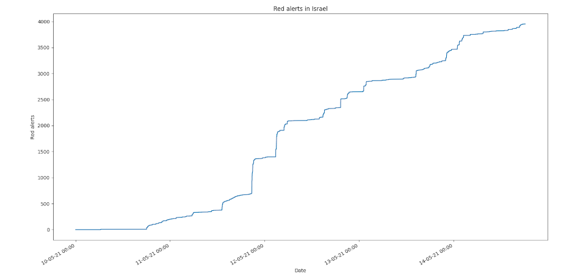

# Red Alert Analyzer

This is a small afternoon project I created in order to plot red-alerts on a graph.


## Installation
Just install using pip
```bash
pip3 install -r requirements.txt
```

## Examples
### The entire country
```bash
./analyzer.py
```

### For a specified location and start date
```bash
./analyzer.py --location "Nachal Oz" --start-date 2021-05-13
./analyzer.py --language he --location ראשון לציון
```
Note: `--language` must be passed in order to search in hebrew
